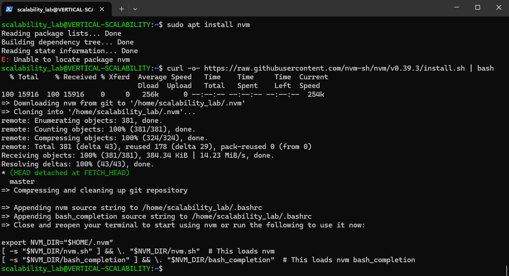
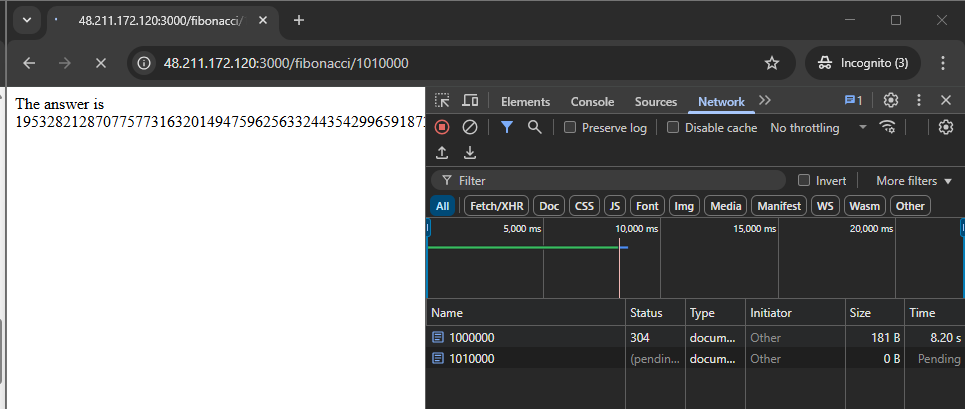
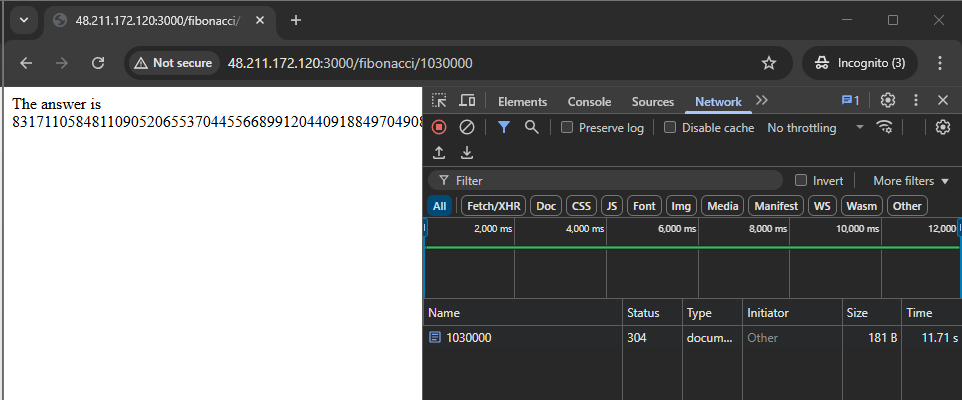

### Escuela Colombiana de Ingeniería
### Arquitecturas de Software - ARSW

## Escalamiento en Azure con Maquinas Virtuales, Sacale Sets y Service Plans

### Dependencias
* Cree una cuenta gratuita dentro de Azure. Para hacerlo puede guiarse de esta [documentación](https://azure.microsoft.com/es-es/free/students/). Al hacerlo usted contará con $100 USD para gastar durante 12 meses.

### Parte 0 - Entendiendo el escenario de calidad

Adjunto a este laboratorio usted podrá encontrar una aplicación totalmente desarrollada que tiene como objetivo calcular el enésimo valor de la secuencia de Fibonnaci.

**Escalabilidad**
Cuando un conjunto de usuarios consulta un enésimo número (superior a 1000000) de la secuencia de Fibonacci de forma concurrente y el sistema se encuentra bajo condiciones normales de operación, todas las peticiones deben ser respondidas y el consumo de CPU del sistema no puede superar el 70%.

### Parte 1 - Escalabilidad vertical

1. Diríjase a el [Portal de Azure](https://portal.azure.com/) y a continuación cree una maquina virtual con las características básicas descritas en la imágen 1 y que corresponden a las siguientes:
    * Resource Group = SCALABILITY_LAB
    * Virtual machine name = VERTICAL-SCALABILITY
    * Image = Ubuntu Server 
    * Size = Standard B1ls
    * Username = scalability_lab
    * SSH publi key = Su llave ssh publica


2. Para conectarse a la VM use el siguiente comando, donde las `x` las debe remplazar por la IP de su propia VM (Revise la sección "Connect" de la virtual machine creada para tener una guía más detallada).

    `ssh scalability_lab@xxx.xxx.xxx.xxx`


3. Instale node, para ello siga la sección *Installing Node.js and npm using NVM* que encontrará en este [enlace](https://linuxize.com/post/how-to-install-node-js-on-ubuntu-18.04/).


4. Para instalar la aplicación adjunta al Laboratorio, suba la carpeta `FibonacciApp` a un repositorio al cual tenga acceso y ejecute estos comandos dentro de la VM:

    `git clone <your_repo>`

    `cd <your_repo>/FibonacciApp`

    `npm install`


5. Para ejecutar la aplicación puede usar el comando `npm FibinacciApp.js`, sin embargo una vez pierda la conexión ssh la aplicación dejará de funcionar. Para evitar ese compartamiento usaremos *forever*. Ejecute los siguientes comando dentro de la VM.

    ` node FibonacciApp.js`


6. Antes de verificar si el endpoint funciona, en Azure vaya a la sección de *Networking* y cree una *Inbound port rule* tal como se muestra en la imágen. Para verificar que la aplicación funciona, use un browser y user el endpoint `http://xxx.xxx.xxx.xxx:3000/fibonacci/6`. La respuesta debe ser `The answer is 8`.


7. La función que calcula en enésimo número de la secuencia de Fibonacci está muy mal construido y consume bastante CPU para obtener la respuesta. Usando la consola del Browser documente los tiempos de respuesta para dicho endpoint usando los siguintes valores:
    * 1000000
    * 1010000
    * 1020000
    * 1030000
    * 1040000
    * 1050000
    * 1060000
    * 1070000
    * 1080000
    * 1090000    


8. Dírijase ahora a Azure y verifique el consumo de CPU para la VM. (Los resultados pueden tardar 5 minutos en aparecer).


9. Ahora usaremos Postman para simular una carga concurrente a nuestro sistema. Siga estos pasos.
    * Instale newman con el comando `npm install newman -g`. Para conocer más de Newman consulte el siguiente [enlace](https://learning.getpostman.com/docs/postman/collection-runs/command-line-integration-with-newman/).
    * Diríjase hasta la ruta `FibonacciApp/postman` en una maquina diferente a la VM.
    * Para el archivo `[ARSW_LOAD-BALANCING_AZURE].postman_environment.json` cambie el valor del parámetro `VM1` para que coincida con la IP de su VM.
    * Ejecute el siguiente comando.

    ```
    newman run ARSW_LOAD-BALANCING_AZURE.postman_collection.json -e [ARSW_LOAD-BALANCING_AZURE].postman_environment.json -n 10 &
    newman run ARSW_LOAD-BALANCING_AZURE.postman_collection.json -e [ARSW_LOAD-BALANCING_AZURE].postman_environment.json -n 10
    ```


10. La cantidad de CPU consumida es bastante grande y un conjunto considerable de peticiones concurrentes pueden hacer fallar nuestro servicio. Para solucionarlo usaremos una estrategia de Escalamiento Vertical. En Azure diríjase a la sección *size* y a continuación seleccione el tamaño `B2ms`.


11. Una vez el cambio se vea reflejado, repita el paso 7, 8 y 9.






12. Evalue el escenario de calidad asociado al requerimiento no funcional de escalabilidad y concluya si usando este modelo de escalabilidad logramos cumplirlo.
Eficiencia: Las peticiones se resuelven en un tiempo menor, la latencia disminuyó. (entre 2 y 4 segundos menos)
Menor uso de recursos: El uso de CPU disminuyó en un 20%

13. Vuelva a dejar la VM en el tamaño inicial para evitar cobros adicionales.

**Preguntas**

1. ¿Cuántos y cuáles recursos crea Azure junto con la VM?

2. ¿Brevemente describa para qué sirve cada recurso?
Azure crea:
- Clave SSH: Es la clave pública asociada a la autenticación SSH.
- Dirección IP pública: Azure la asigna para que se pueda acceder remotamente, desde afuera de la red de Azure.
- Red virtual: Es la red privada en la que está la VM. Permite comunicación entre recursos de Azure.
- Interfaz de red: Conecta la VM con la red virtual y le asigna la IP pública.
3. ¿Al cerrar la conexión ssh con la VM, por qué se cae la aplicación que ejecutamos con el comando `npm FibonacciApp.js`? ¿Por qué debemos crear un *Inbound port rule* antes de acceder al servicio?
Cuando se abre la conexión através de SSH, todos los procesos estarán asociados a esa conexión y terminal. Por tanto, cuando se cierra la terminal, el proceso también se termina. Esto porque el proceso de Shell mata a sus procesos hijos, entre los cuales se encuentran los ejecutas en la máquina virtual. Para evitar esto se pueden usar herramientas que ejecuten el proceso directamente en la máquina en segundo plano y no dependa de la conexión.
Para poder permitir que la aplicación sea accesible desde otras máquinas hay que permitir el tráfico entrante, para ello se crea la regla de entrada. 
4. Adjunte tabla de tiempos e interprete por qué la función tarda tando tiempo.


Las peticiones tienen que navegar através de la red. Al mandar las solicitudes desde un computador que está fuera de la red de Azure, esta debe de atravesar un camino más largo para llegar al destino. A diferencia de que si hicieramos las pruebas directamente en localhost o con otra máquina que se encuentre en la misma red que la máquina que aloja la aplicación.
5. Adjunte imágen del consumo de CPU de la VM e interprete por qué la función consume esa cantidad de CPU.

Puede que el algoritmo de fibonacci sea poco eficiente, tenga una complejidad alta, ya sea algoritmica o en memoría.
6. Adjunte la imagen del resumen de la ejecución de Postman. Interprete:
    * Tiempos de ejecución de cada petición.
    * Si hubo fallos documentelos y explique.

Nos quiere decir que se ejecutaron 10 solicitudes, 10 scripts, de los cuales ninguno falló. Las pruebas tomaron un tiempo total de 1:24, con un tiempo de respuesta promedio de 8.3s. Siendo la solicitud más rápida en 8.2s y la más lenta en 8.4s.
7. ¿Cuál es la diferencia entre los tamaños `B2ms` y `B1ls` (no solo busque especificaciones de infraestructura)?

| Característica              | B1ls                                      | B2ms                                       |
|----------------------------|-------------------------------------------|--------------------------------------------|
| **vCPU**                   | 1                                         | 2                                          |
| **RAM**                    | 0.5 GB                                    | 8 GB                                       |
| **Precio**                 | Muy bajo                                  | Medio                                      |
| **Rendimiento sostenido** | Muy limitado (para tareas ligeras)        | Mayor capacidad para cargas moderadas      |
| **Bursting (créditos)**    | Sí, con muy pocos créditos                | Sí, con más créditos disponibles           |
| **Disco temporal**         | No garantizado                            | Disponible                                 |
| **Usos recomendados**      | Pruebas simples, scripts livianos         | Apps web, APIs, backend liviano            |

B1ls está pensado para:
- Tareas intermitentes, con muy poca carga.
- Pruebas, scripts, agentes de automatización.
- No es ideal para apps web que reciben muchas peticiones.
B2ms es una VM más balanceada, ideal si:
- Tienes un backend en Node.js, Spring, Flask, etc.
- Esperas cierto tráfico concurrente.
- Necesitas manejar respuestas rápidas sin agotarte los créditos de CPU.
8. ¿Aumentar el tamaño de la VM es una buena solución en este escenario?, ¿Qué pasa con la FibonacciApp cuando cambiamos el tamaño de la VM?
Depende, del caso, si van a ser pocos usuarios quizás ni valdría la pena. Si se quiere como solución temporal e instantanea, podría servir. Pero quizás la mejor solución sería revisar el algoritmo y reducir su complejidad, como alternativa, usar la función de Fibonnaci, lo que implica hacer un cálculo en un O(1).
La aplicación responde un poco más rápido, aunque por momentos tiene bajones.
9. ¿Qué pasa con la infraestructura cuando cambia el tamaño de la VM? ¿Qué efectos negativos implica?
Azure detiene y reinstancia la VM. Para cambiar el tamaño, Azure apaga la VM, la mueve a otro host físico compatible con el nuevo tamaño y luego la reinicia. Durante ese proceso, la VM queda temporalmente no disponible.
Las direcciones IP dinámicas pueden cambiar.
10. ¿Hubo mejora en el consumo de CPU o en los tiempos de respuesta? Si/No ¿Por qué?
Si hubo mejora, los tiempos y el consumo de recursos reducieron.
11. Aumente la cantidad de ejecuciones paralelas del comando de postman a `4`. ¿El comportamiento del sistema es porcentualmente mejor?
No es mejor, tiende a quedarse más, la misma máquina tiene que resolver más solicitudes.
### Parte 2 - Escalabilidad horizontal

#### Crear el Balanceador de Carga

Antes de continuar puede eliminar el grupo de recursos anterior para evitar gastos adicionales y realizar la actividad en un grupo de recursos totalmente limpio.

1. El Balanceador de Carga es un recurso fundamental para habilitar la escalabilidad horizontal de nuestro sistema, por eso en este paso cree un balanceador de carga dentro de Azure tal cual como se muestra en la imágen adjunta.


2. A continuación cree un *Backend Pool*, guiese con la siguiente imágen.


3. A continuación cree un *Health Probe*, guiese con la siguiente imágen.


4. A continuación cree un *Load Balancing Rule*, guiese con la siguiente imágen.


5. Cree una *Virtual Network* dentro del grupo de recursos, guiese con la siguiente imágen.


#### Crear las maquinas virtuales (Nodos)

Ahora vamos a crear 3 VMs (VM1, VM2 y VM3) con direcciones IP públicas standar en 3 diferentes zonas de disponibilidad. Después las agregaremos al balanceador de carga.

1. En la configuración básica de la VM guíese por la siguiente imágen. Es importante que se fije en la "Avaiability Zone", donde la VM1 será 1, la VM2 será 2 y la VM3 será 3.


2. En la configuración de networking, verifique que se ha seleccionado la *Virtual Network*  y la *Subnet* creadas anteriormente. Adicionalmente asigne una IP pública y no olvide habilitar la redundancia de zona.


3. Para el Network Security Group seleccione "avanzado" y realice la siguiente configuración. No olvide crear un *Inbound Rule*, en el cual habilite el tráfico por el puerto 3000. Cuando cree la VM2 y la VM3, no necesita volver a crear el *Network Security Group*, sino que puede seleccionar el anteriormente creado.


4. Ahora asignaremos esta VM a nuestro balanceador de carga, para ello siga la configuración de la siguiente imágen.


5. Finalmente debemos instalar la aplicación de Fibonacci en la VM. para ello puede ejecutar el conjunto de los siguientes comandos, cambiando el nombre de la VM por el correcto

```
git clone https://github.com/daprieto1/ARSW_LOAD-BALANCING_AZURE.git

curl -o- https://raw.githubusercontent.com/creationix/nvm/v0.34.0/install.sh | bash
source /home/vm1/.bashrc
nvm install node

cd ARSW_LOAD-BALANCING_AZURE/FibonacciApp
npm install

npm install forever -g
forever start FibonacciApp.js
```


Realice este proceso para las 3 VMs, por ahora lo haremos a mano una por una, sin embargo es importante que usted sepa que existen herramientas para aumatizar este proceso, entre ellas encontramos Azure Resource Manager, OsDisk Images, Terraform con Vagrant y Paker, Puppet, Ansible entre otras.


#### Probar el resultado final de nuestra infraestructura

1. Porsupuesto el endpoint de acceso a nuestro sistema será la IP pública del balanceador de carga, primero verifiquemos que los servicios básicos están funcionando, consuma los siguientes recursos:

```
http://52.155.223.248/
http://52.155.223.248/fibonacci/1
```


2. Realice las pruebas de carga con `newman` que se realizaron en la parte 1 y haga un informe comparativo donde contraste: tiempos de respuesta, cantidad de peticiones respondidas con éxito, costos de las 2 infraestrucruras, es decir, la que desarrollamos con balanceo de carga horizontal y la que se hizo con una maquina virtual escalada.


| Característica                          | Escalabilidad Vertical                        | Escalabilidad Horizontal                        |
|----------------------------------------|-----------------------------------------------|-------------------------------------------------|
| **Tiempos de respuesta**               | Mejora inicialmente, pero puede saturarse     | Se mantiene estable al distribuir la carga      |
| **Cantidad de peticiones exitosas**    | Limitada por los recursos de una sola máquina | Aumenta al agregar más instancias               |
| **Costos de infraestructura**          | Menor al inicio, pero sube rápidamente        | Inicialmente más costosa, pero más escalable   |


3. Agregue una 4 maquina virtual y realice las pruebas de newman, pero esta vez no lance 2 peticiones en paralelo, sino que incrementelo a 4. Haga un informe donde presente el comportamiento de la CPU de las 4 VM y explique porque la tasa de éxito de las peticiones aumento con este estilo de escalabilidad.

```
newman run ARSW_LOAD-BALANCING_AZURE.postman_collection.json -e [ARSW_LOAD-BALANCING_AZURE].postman_environment.json -n 10 &
newman run ARSW_LOAD-BALANCING_AZURE.postman_collection.json -e [ARSW_LOAD-BALANCING_AZURE].postman_environment.json -n 10 &
newman run ARSW_LOAD-BALANCING_AZURE.postman_collection.json -e [ARSW_LOAD-BALANCING_AZURE].postman_environment.json -n 10 &
newman run ARSW_LOAD-BALANCING_AZURE.postman_collection.json -e [ARSW_LOAD-BALANCING_AZURE].postman_environment.json -n 10
```
La licencia de estudiante permite únicamente tener 3 direcciones IP públicas. Una se va en el balanceador y otras 2 en las dos máquinas que creamos.
**Preguntas**

* ¿Cuáles son los tipos de balanceadores de carga en Azure y en qué se diferencian?, ¿Qué es SKU, qué tipos hay y en qué se diferencian?, ¿Por qué el balanceador de carga necesita una IP pública?
Tipos de balanceadores:
- Load Balancer: Nivel de red (Layer 4, TCP/UDP). Reparte tráfico entre VMs. Ideal para tráfico interno o externo.
- Application Gateway: Nivel de aplicación (Layer 7, HTTP/HTTPS). Permite balanceo inteligente, redirección, WAF. Ideal para apps web.
- Traffic Manager: DNS-based, dirige tráfico a regiones según latencia, disponibilidad o prioridad. Global.
- Front Door: Para apps web globales. Provee balanceo a nivel HTTP/HTTPS, enrutamiento global y aceleración.
¿Qué es SKU en Azure?
SKU (Stock Keeping Unit) define el tipo, capacidad y características de un recurso en Azure. En Load Balancers, hay dos SKUs:
- Basic: Gratuito, funcionalidad limitada, sin zonas de disponibilidad. Soporta menos reglas.
- Standard: Mayor rendimiento, seguridad, escalabilidad. Requiere configuración explícita de NSG y Health Probes. Soporta zonas de disponibilidad.
¿Por qué el Load Balancer necesita una IP pública?
Para que el tráfico externo (por ejemplo, desde Postman o navegador) pueda acceder a las VMs del backend, el Load Balancer debe tener una IP pública. Esa IP es la "puerta de entrada" para las solicitudes que luego se distribuyen internamente. Cómo lo haría un cliente desde un navegador Web.
* ¿Cuál es el propósito del *Backend Pool*?
El Backend Pool define el grupo de instancias (como VMs) que recibirán tráfico del Load Balancer. Es el conjunto de destinos donde se balancea la carga.
* ¿Cuál es el propósito del *Health Probe*?
Permite verificar la salud de las instancias en el backend pool. Si una VM no responde a la prueba de salud (por ejemplo, un ping o una petición HTTP), el Load Balancer deja de enviarle tráfico. Para así cumplir con el criterio de disponibilidad.
* ¿Cuál es el propósito de la *Load Balancing Rule*? ¿Qué tipos de sesión persistente existen, por qué esto es importante y cómo puede afectar la escalabilidad del sistema?.
¿Cuál es el propósito de la Load Balancing Rule?
Define cómo se distribuye el tráfico. Incluye:
- El puerto de entrada y salida (por ejemplo, de la IP pública al puerto de la app).
- El protocolo (TCP/UDP).
- El Backend Pool y el Health Probe asociados.
Persistencia de Sesión (Session Affinity):
- None: Las solicitudes pueden ir a cualquier instancia. Mejor escalabilidad.
- Client IP: Se fija el destino por dirección IP del cliente. Útil para sesiones que necesitan consistencia.
- Client IP + Protocol: Más específico. Se mantiene la sesión por IP y protocolo.
* ¿Qué es una *Virtual Network*? ¿Qué es una *Subnet*? ¿Para qué sirven los *address space* y *address range*?
Virtual Network (VNet): Es una red privada en la nube de Azure donde se alojan recursos como VMs, bases de datos, etc.

Subnet: Es una segmentación de la VNet, permite aislar recursos y gestionar mejor el tráfico y seguridad.

Address Space: Rango completo de direcciones IP disponibles en una VNet (ej: 10.0.0.0/16).

Address Range: Segmentos asignados a cada Subnet dentro del espacio total.

* ¿Qué son las *Availability Zone* y por qué seleccionamos 3 diferentes zonas?. ¿Qué significa que una IP sea *zone-redundant*?
¿Qué son las Availability Zones?
Son zonas físicas separadas dentro de una región (centros de datos diferentes). Seleccionar 3 zonas distintas aumenta la alta disponibilidad, ya que si una zona falla, las otras siguen activas.
¿Qué significa que una IP sea zone-redundant?
Significa que esa IP puede seguir operativa incluso si una de las zonas falla, ya que está replicada entre zonas. Mejora la disponibilidad del Load Balancer.
* ¿Cuál es el propósito del *Network Security Group*?
Controla el tráfico de red hacia y desde recursos de Azure. Define reglas de acceso (permitir o denegar) basadas en:
- IP de origen y destino
- Puerto
- Protocolo
Es como un firewall de red para tus VMs y subredes.
* Informe de newman 1 (Punto 2)


Analizando la repartición que hizo el balanceador a las diferentes instancias, notamos un desface bastante considerable. Ensayando desde dos máquinas obtuvimos que la primera VM recibió 50 y la segunda 30. Esto porque la configuración que trae por defecto el balanceador trata de que todas las peticiones de una misma dirección vayan a la misma máquina para que esta pueda mantener un contexto. 
* Presente el Diagrama de Despliegue de la solución.


### Diagrama de Despliegue


